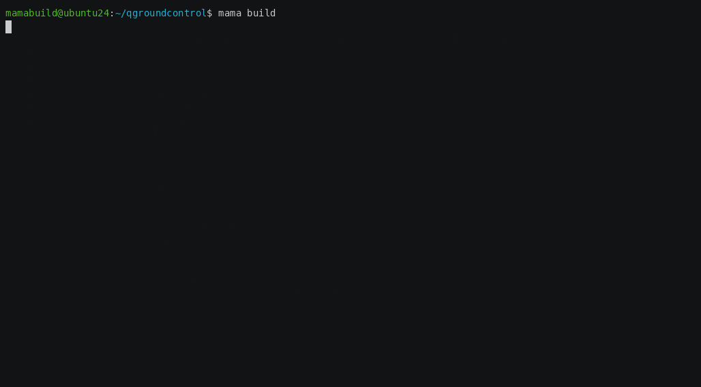

# Mama Build Tool
Mama - A modular C++ build tool so simple even your mama can use it

Mama turns a tree of C++ libraries, your own and third-party, into a single `mama build`.
It clones, configures and builds them in dependency order for every platform and compiler
you target, then links the results into your project. No central package repository, no
Docker, no hand-written toolchain glue: only git repos, a minimal set of system libs, and
the compilers you already have.

Building is one command: `mama build windows`. Mama picks up trivial CMake projects and
header-only or stand-alone C libraries automatically. Larger projects add a small
`mamafile.py` to declare their dependencies and build steps.



## Recent changes

**0.14.3** (2026-Sep-05)
 - feature: added generic AARCH64 Linux platform for easier cross-builds

**0.14.2** (2026-Sep-03)
 - fix: correctly detect symlinked gcc-14 compiler installation

**0.14.1** (2026-Aug-26)
- feature: lock Git dependency commits across multiple platform graphs
- bugfix: a targeted build relinks source-built parents after a child rebuilds
- bugfix: a TLS certificate failure no longer skips every later fetch and clone
- bugfix: the default job count reads the container cpu limit, not the host
- bugfix: a mama.cmake include in a subdirectory CMakeLists.txt gets a proxy
- bugfix: mama replaces a mama.cmake only when it generated that file

## Why Mama

- **One command, the whole DAG.** Mama resolves C++ dependencies into a build graph and drives it
  end to end: clone, configure, compile, in dependency order. `mama build <target>` does only that
  target's subtree.
- **Everything parallel.** Clones, configures and compiles run at once under one scheduler, so a
  leaf builds while a deeper dep still clones. The slowest subtrees launch first, and the core
  budget is RAM-capped so a wide build cannot OOM the box.
- **Multi-platform, multi-compiler, no Docker.** `linux`, `linux-clang`, `windows`, `android` and
  other cross-builds land side by side, never clobbering. For three platforms, run three builds,
  `mama build <platform>` each. Sanitizers (asan/lsan/tsan/ubsan) and coverage are plain flags.
- **Any build system.** CMake, GNU Make, MSBuild, or a custom `build()` step, all through the
  same scheduler and live display.
- **Faster CMake configures.** Compiler detection (~5s of a ~6.5s cold configure) runs once per
  toolchain, and every fresh build dir reuses the result.
- **In-source, project-scoped, reproducible.** Dependencies pull from git (pinned by
  tag/branch/commit) or local folders. Heavy libs like OpenCV and FFmpeg build from source, so a
  fresh checkout builds identically with only a minimal set of system libs assumed.
- **Resilient and cached.** Fail-fast Ctrl+C, self-healing build dirs after an interrupted
  configure, and `mama upload` to a private artifactory server so matching commits are fetched
  instead of rebuilt.
- **Build stats.** `mama build buildstats` prints per-package timing bars plus a
  frontend/backend/link breakdown (MSVC vcperf, Clang `-ftime-trace`): the slowest TUs, costliest
  headers, heaviest codegen.
- **Also included.** Correct-order linking via `MAMA_INCLUDES`/`MAMA_LIBS`, `clang-tidy` and
  coverage as flags, and `mama init` to adopt an existing CMake project in one step.

For additional documentation explore: [build_target.py](mama/build_target.py)


## Who is this FOR?
Anyone who develops cross-platform C++ libraries or applications for any combination of
[Windows, Linux, macOS, iOS, Android, Raspberry, Oclea, Xilinx, MIPS, i.MX8MP]. And anyone
who wants a reproducible, project-scoped package and build system instead of incompatible
system-wide libraries and the linker bugs they cause. Your builds do not rely on
hard-to-configure system packages. All you need to type is `mama build`.

### Supported platforms ###
- Windows (64-bit x86_64, 32-bit x86, 64-bit arm64, 32-bit armv7) default is latest MSVC
- Linux (Ubuntu) (64-bit x86_64, 32-bit x86, 64-bit arm64) both GCC and Clang
- MacOS (64-bit x86_64, 64-bit arm64) via config.macos_version
- iOS (64-bit arm64) via config.ios_version
- Android (64-bit arm64, 32-bit armv7) via env ANDROID_NDK_HOME or ANDROID_HOME
- Raspberry Pi (64-bit arm64 default, 32-bit armv7 via `raspi32`) via env RASPI_HOME
- Generic AArch64 Linux (64-bit arm64, boards with no vendor SDK) via `aarch64` and env AARCH64_HOME
- Oclea (64-bit arm64) via config.set_oclea_toolchain() or env OCLEA_HOME
- i.MX8M Plus (64-bit arm64 NXP i.MX8M Plus) via config.set_imx8mp_toolchain() or env IMX8MP_SDK_HOME
- MIPS (mips, mipsel, mips64, mips64el) via config.set_mips_toolchain()
- Xilinx (64-bit arm64 Zynq UltraScale+ MPSoC) via config.set_xilinx_toolchain() or env XILINX_HOME

## Who is this NOT for?
Single-platform projects with platform-specific build configuration and system-wide dependency
management, such as Linux-only G++ projects using apt-get libraries or iOS-only apps using cocoapods.


## Artifactory
`mama upload mypackage` uploads a prebuilt package to a private artifactory server. A build then
uses the package automatically when the git dependency's commit hash matches.


## Setup For Users
1. Get Python 3.10+ and PIP
2. `$ pip install mama --upgrade`
3. `$ cd yourproject`
4. `$ mama init` which creates a `mamafile.py` and patches your CMakeLists.txt
5. (optional) Manual setup: Create your own `mamafile.py` (examples below) and add this to your CMakeLists.txt:
```cmake
include(mama.cmake)
include_directories(${MAMA_INCLUDES})
target_link_libraries(YourProject PRIVATE ${MAMA_LIBS})
```
6. `$ mama build`
7. `$ mama open` to open your project in an IDE / VSCode


## Command examples
```
  mama init                      Initialize a new project. Tries to create mamafile.py and CMakeLists.txt
  mama build                     Build main project only. Clones missing deps, but does not git pull.
  mama build x86 opencv          Cross compile build target opencv to x86 architecture
  mama build android             Cross compile to arm64 android NDK (default API level 29)
  mama build android-31          Cross compile to arm64 with Android API level 31
  mama build android-26 arm      Cross compile to armv7 android NDK API level 26
  mama update                    Update all dependencies by doing git pull and build.
  mama lock platforms=linux,windows,android Resolve all Git dependencies into mama.lock.
  mama lock dep1 platforms=linux Refresh dep1 while preserving other locked commits.
  mama lock dep1 commit=<sha> platforms=linux Select a reachable dep1 commit for this lock.
  mama clean                     Cleans main project only.
  mama clean x86 opencv          Cleans opencv for x86 architecture.
  mama clean all                 Cleans EVERYTHING in the dependency chain for current arch.
  mama rebuild                   Cleans, update and build main project only.
  mama rebuild deps_only         Cleans and rebuilds all dependencies, but not the main project.
  mama rebuild dep1 deps_only    Cleans and rebuilds only dep1's dependencies, skipping dep1 itself.
  mama build dep1 deps_only      Build only dep1's dependencies, skipping dep1 itself.
  mama configure deps_only       Reconfigures and rebuilds all dependencies, but not the main project.
  mama build dep1                Build dep1 only. Clones if missing, but does not git pull.
  mama update dep1               Update and build the specified target.
  mama serve android             Update, rebuild, deploy and upload for Android.
  mama deploy                    Runs PAPA deploy stage.
  mama configure                 Run CMake configure on dependencies to reconfigure and build
  mama configure tsan            CMake Reconfigure dependencies with thread sanitizer enabled
  mama wipe dep1                 Wipe target dependency completely and clone again.
  mama upload dep1               Deploys and uploads dependency to Artifactory server.
  mama dep1 unpublish=current    Delete the published archives of this version, on every platform.
  mama dep1 unpublish=prune-old  Delete every version except the newest 20.
  mama list                      List all mama dependencies on this project.
  mama dirty dep1                Mark a target for rebuild even if it was up to date.
  mama version                   Show the mama package version.
  mama test                      Run tests on main project.
  mama test=arg                  Run tests on main project with an argument.
  mama test="arg1 arg2"          Run tests on main project with multiple arguments.
  mama test dep1                 Run tests on target dependency project.
  mama test="mytest" test_until_failure=100 Run tests in a loop until failure, useful for catching flaky tests.
  mama dep1 start=dbtool         Call target project mamafile start() with args [`dbtool`].
```
Call `mama help` for more usage information.

When `mama.lock` exists, every build uses its exact Git commits. Mamafiles still own the dependency
graph and selectors. Regenerate the lock after changing either one. Do not edit the generated JSON.

### Build flags
```
  release                        (default) Build with CMake RelWithDebInfo configuration.
  debug                          Build with CMake Debug configuration.
  clang                          Prefer Clang compiler on Linux.
  gcc                            Prefer GCC compiler on Linux.
  x86 | x64 | arm | arm64       Select target architecture.
  arch=<arch>                    Override cross-compiling architecture explicitly.
  jobs=N                         Limit maximum parallel compilations.
  with_tests                     Forces -DENABLE_TESTS=ON and -DBUILD_TESTS=ON.
  fortran                        Enable automatic Fortran compiler detection.
  flags="-Wextra -O3"            Pass additional compiler flags.
  clang-tidy                     Enable clang-tidy static analysis during build.
  silent                         Greatly reduces output verbosity.
  verbose                        Greatly increases output verbosity.
  buildstats                     After the build, print per-package timing bars and a deep compiler breakdown.
  parallel                       Load dependencies in parallel.
  deps_only                      Only execute build/rebuild/clean on dependencies, skip the main target.
                                 When combined with a target name, applies to that target's dependencies only.
  unshallow                      Allow unshallowing shallow git clones.
  https-override                 Rewrite all add_git() ssh urls (git@host:path) to https://host/path.
  ssh-override                   Rewrite all add_git() https urls to ssh (git@host:path).
```

The `https-override` / `ssh-override` flags rewrite the git access protocol of every
`add_git()` dependency at build time, without editing any mamafile. Use `https-override`
for hosts that only allow https access tokens (no ssh keys), and `ssh-override` for hosts
where https is blocked and ssh keys are required. They work for GitHub, GitLab (including
nested groups), Bitbucket and self-hosted/custom-port servers. Local paths (`/srv/..`,
`file://`, `C:/..`) stay untouched. The conversion drops embedded https credentials and ssh
custom ports, and re-points an existing clone's `origin` remote so `fetch`/`pull` follow
the chosen protocol.

```
  mama build https-override      git@github.com:example/repo.git -> https://github.com/example/repo.git
  mama build ssh-override        https://github.com/RedFox20/ReCpp.git -> git@github.com:RedFox20/ReCpp.git
```

### Artifactory flags
```
  if_needed                      Only upload if package does not already exist on server.
  art                            Always fetch packages from artifactory; failure will throw.
  noart                          Skip artifactory fetching. The local CACHE is still used and fetches check git staleness.
```

### Sanitizer and coverage flags
```
  sanitize=address               Enable -fsanitize=<type> for GCC/Clang.
  asan                           Shorthand for sanitize=address.
  lsan                           Shorthand for sanitize=leak.
  tsan                           Shorthand for sanitize=thread.
  ubsan                          Shorthand for sanitize=undefined.
  coverage                       Build with GCC --coverage option.
  coverage-report[=src_root]     Generate coverage report using gcovr.
```

### Build statistics: `buildstats`

`mama build buildstats` prints a timing report after the build finishes.

```
mama build buildstats             # timing report for the whole dependency chain
mama rebuild all buildstats       # full rebuild, so every package shows real compile time
mama build buildstats opencv      # scope the deep breakdown to a single target
```

**Stage 1 - per-package bars.** One normalized horizontal bar per package, slowest first,
segmented into load (git/artifactory), configure (CMake) and build (compile+link), with the
package's total wall time on the right. Bar length scales against the slowest package.
Packages faster than 0.33s are omitted as noise. UTF-8 terminals get block shades, legacy
Windows code pages fall back to ASCII.

```
  Build times     ░ load  ▒ configure  ▓ build
  opencv          ░▒▓▓▓▓▓▓▓▓▓▓▓▓▓▓▓▓▓▓▓▓▓▓▓▓▓▓   2m 12s
  ReCpp           ░▒▒▓▓▓▓▓▓                       31.4s
```

**Stage 2 - deep compiler breakdown.** Where the compile time went: frontend (parse) vs
backend (codegen) vs link, the achieved build parallelism, the slowest translation units,
the costliest headers (total parse time and include count) and the costliest codegen
symbols. This stage is compiler-specific:

- **MSVC** - mama wraps the build in a [vcperf](https://learn.microsoft.com/en-us/cpp/build-insights/)
  `/timetrace` session and writes the trace to `packages/<project>/<platform>/mama_timetrace.json`.
  vcperf must be on `PATH`, in the MSVC toolset, or pointed at by the `VCPERF` env var. A one-time
  elevated `vcperf /grantusercontrol` enables capture without admin rights. Without vcperf,
  Stage 1 still prints and mama skips Stage 2 with a warning.
- **Clang** - mama instruments the build with `-ftime-trace` and collects the per-TU JSONs
  written during this run from the build dirs. Use `mama build clang buildstats` on Linux.
- **GCC** - no per-file trace exists, so only Stage 1 prints.

Both stages only see what this run compiled. An up-to-date incremental build reports
`no compiler activity captured`, so use `rebuild` to profile a full build.

### Clang-Tidy static analysis

Mama runs [clang-tidy](https://clang.llvm.org/extra/clang-tidy/) static analysis during the build.
When enabled, CMake sets `CMAKE_C_CLANG_TIDY` and `CMAKE_CXX_CLANG_TIDY` so clang-tidy runs
on every compiled source file.

```
mama build clang-tidy             # Run clang-tidy analysis during build
mama build clang-tidy debug       # Combine with other flags
```

Mama resolves clang-tidy in this order:
1. The `CLANG_TIDY` environment variable (`ANDROID_CLANG_TIDY` for Android builds)
2. The Android NDK bin directory, for Android builds
3. System `PATH` lookup

If clang-tidy is not found, a warning is printed and the build proceeds without static analysis.

Place a `.clang-tidy` configuration file in your project root to control which checks are enabled:
```yaml
Checks: >
  cppcoreguidelines-avoid-reference-coroutine-parameters

WarningsAsErrors: >
  cppcoreguidelines-avoid-reference-coroutine-parameters

ExtraArgsBefore:
  - -Wno-unknown-warning-option
```

You can also enable clang-tidy programmatically from a mamafile:
```py
def settings(self):
    self.config.set_clang_tidy_path()             # auto-detect from PATH or CLANG_TIDY env
    self.config.set_clang_tidy_path('/usr/bin/clang-tidy-18')  # explicit path
```

### Install utilities
```
  install-clang-<ver>            Install Clang <ver> for Ubuntu. Ex: install-clang-18
  install-gcc-<ver>              Install GCC <ver> for Linux. Ex: install-gcc-13
  install-msbuild                Install MSBuild for Linux.
  install-ndk-<ver>              Install Android NDK <ver> for Linux/Windows. Ex: install-ndk-25c. install-ndk- lists versions.
```

## Mamafile Reference

### Requiring a minimum mamabuild version

When a mamafile relies on newer mamabuild features, declare the minimum version. If mama is
too old, the build aborts during target load, before any configure or build work:

```py
def settings(self):
    self.requires_version('0.13.01')
```

```
Target myapp requires mamabuild >= 0.13.01, but this is 0.12.5. Upgrade with:  pip install --upgrade mama
```

Versions compare segment-wise as numbers, so `0.13.01` outranks `0.9.5` and a shorter
version zero-pads (`0.13` < `0.13.01`).

> Note: `requires_version` itself exists only from 0.13.01 onward. An older mama fails with
> `AttributeError: ... has no attribute 'requires_version'`, which is still the signal to upgrade.

### Adding dependencies

```py
# Git dependency with full options:
self.add_git('ReCpp', 'https://github.com/RedFox20/ReCpp.git',
             git_branch='master',  # track a branch (default: repo default branch)
             git_tag='v1.2.3',     # pin to a specific git tag
             git_commit='abc123',  # OR pin to a specific commit hash (alias of git_tag argument)
             mamafile='recpp.py',  # explicit mamafile path (default: auto-detect {src}/mamafile.py)
             shallow=True,         # shallow clone with --depth 1 (default: True)
             args=['CXX20'])       # pass custom arguments to child target's self.args

# Local dependency with full options:
self.add_local('utils', 'libs/utils',
               mamafile=None,       # explicit mamafile path (default: auto-detect {src}/mamafile.py)
               always_build=False,  # force rebuild every time (useful for active sub-projects)
               args=[])             # pass custom arguments to child target's self.args

# Artifactory prebuilt package:
self.add_artifactory_pkg('opencv', version='df76b66')      # by commit hash
self.add_artifactory_pkg('opencv', fullname='opencv-linux-x64-release-df76b66')  # by full name
```

The `args` parameter passes custom arguments to the child target, accessible via `self.args`:
```py
class MyLib(mama.BuildTarget):
    def configure(self):
        if 'CXX20' in self.args:
            self.enable_cxx20()
        if 'SHARED' in self.args:
            self.add_cmake_options('BUILD_SHARED_LIBS=ON')
```

**Mamafile discovery**: Without an explicit `mamafile=` path, mama first checks
`mama/{name}.py` in the parent project, then `mamafile.py` in the dependency's source root.

### Inter-dependency configuration

```py
# Get a dependency's exported include path and library paths:
zinclude, zlibrary = self.get_target_products('zlib')
self.add_cmake_options(f'ZLIB_INCLUDE_DIR={zinclude}')
self.add_cmake_options(f'ZLIB_LIBRARY={zlibrary}')

# Or inject one dependency's products into another as CMake defines:
self.inject_products(dst_dep='libpng', src_dep='zlib',
                     include_path='ZLIB_INCLUDE_DIR',
                     libs='ZLIB_LIBRARY')

# Retrieve all injected product defines collected via inject_products():
defines = self.get_product_defines()  # returns list of CMake defines
```

### Overridable methods

Mamafile classes extend `mama.BuildTarget` and can override these methods:

| Method | Description |
|--------|-------------|
| `dependencies(self)` | Add git, local, or artifactory dependencies |
| `settings(self)` | Define settings (called first, after clone) |
| `configure(self)` | Pre-build CMake configuration options |
| `build(self)` | Override the default `cmake_build()` behavior |
| `package(self)` | Post-build: define exported includes, libs, assets |
| `install(self)` | Override the default `cmake_install()` step |
| `deploy(self)` | Custom deployment logic |
| `clean(self)` | Custom pre-clean steps |
| `test(self, args)` | Test runner invoked by `mama test` |
| `start(self, args)` | Custom entrypoint invoked by `mama start=<arg>` |
| `init(self)` | Initialization after mamafile is loaded |

### Class attributes

| Attribute | Default | Description |
|-----------|---------|-------------|
| `workspace` | `None` | Local workspace folder for build intermediates |
| `global_workspace` | `None` | System-wide workspace folder name |
| `cmake_build_type` | `'RelWithDebInfo'` | CMake build type (or `'Debug'` with `debug` flag) |
| `cmake_lists_path` | `'CMakeLists.txt'` | Path to the CMakeLists.txt relative to source |
| `cmake_command` | `'cmake'` | CMake executable path |
| `enable_exceptions` | `True` | Enable C++ exceptions |
| `enable_ninja_build` | `True` (if found) | Use Ninja generator when available |
| `enable_unix_make` | `False` | Force Unix Makefiles generator |
| `enable_cxx_build` | `True` | Enable C++ compiler |
| `enable_multiprocess_build` | `True` | Enable parallel compilation |
| `clean_intermediate_files` | `False` | Clean intermediate build files after build |
| `version` | `''` | Replaces the commit hash in the archive name, see [Pinning a version](#pinning-a-version-selfversion) |
| `args` | `[]` | Arguments from the parent's `add_git(args=)` / `add_local(args=)`. Also name the archive and the build dir |

### Platform detection properties

Use these boolean properties in mamafiles for platform-conditional logic:
`self.windows`, `self.msvc`, `self.linux`, `self.macos`, `self.ios`, `self.android`,
`self.raspi`, `self.aarch64`, `self.oclea`, `self.xilinx`, `self.imx8mp`, `self.mips`,
`self.yocto_linux`

`self.config.platform` is the active platform object, and `self.config.platform.name` is its
name (`'linux'`, `'imx8mp'`, ...). See [docs/platforms.md](docs/platforms.md) for how platform
support is structured and how to add one.

Host OS detection: `self.os_windows`, `self.os_linux`, `self.os_macos`

### C++ standard selection (overrides CMakeLists.txt)
```py
self.enable_cxx11()   # or enable_cxx14(), enable_cxx17(), enable_cxx20(), enable_cxx23(), enable_cxx26()

# Query current C++ standard:
if self.is_enabled_cxx20():  # or is_enabled_cxx11/14/17/23/26()
    self.add_cmake_options('USE_CXX20_FEATURES=ON')
```

### Compiler flags
```py
self.add_cxx_flags('-Wall', '-Wextra')               # C++ only flags
self.add_c_flags('-std=c11')                         # C only flags
self.add_cl_flags('-fPIC')                           # Both C and C++ flags
self.add_ld_flags('-lm')                             # Linker flags
self.add_platform_cxx_flags(linux='-fPIC', windows='/W4')  # Per-platform C++ flags
self.add_platform_ld_flags(linux='-pthread')               # Per-platform linker flags
# Any platform name works: windows, linux, macos, ios, android, raspi, aarch64, mips,
# oclea, xilinx, imx8mp, plus yocto_linux for any Yocto board
self.add_platform_cxx_flags(imx8mp='-mcpu=cortex-a53', yocto_linux='-DEMBEDDED=1')
```

### Pinning the instruction set: `set_target_march`

A native build on the host arch compiles with `-march=native`, which bakes the CPU of the build
machine into the binary. A release that has to run on other machines pins a baseline instead. Call it
from the ROOT mamafile `settings()`, so the pin reaches every dependency:

```py
class MyApp(mama.BuildTarget):
    def settings(self):
        self.config.set_target_march('x64', 'x86-64-v3')     # AVX2 baseline, 2015 and newer
        self.config.set_target_march('arm64', 'armv8.2-a')   # one pin per target arch
```

The pin applies only when the run builds that arch, and it replaces whatever `-march` the platform
would emit. An unknown arch name raises. A value that is not the `-march` value alone (`-march=x86-64-v3`,
or two flags in one string) raises. MSVC has no `-march`, so the pin warns and does nothing there.

The pin renames the arch field of the artifactory archive, because a `-march` value already says which
architecture it is. So `x64` plus `x86-64-v3` reads `x64v3`, and `arm64` plus `armv8.2-a` reads
`armv82a`. The bare `x86-64` baseline reads `x64v1`, its psABI level, so it never collides with an
unpinned `x64`:

```
build dir       packages/mylib/linux/                                    unchanged
archive         mylib-ubuntu-22-gcc11.3-x64v3-release-df76b66            renamed
papa.txt        O release linux x64 march=x86-64-v3                      real value
```

**The build dir keeps its name.** A tuned package can never download over a baseline one, which is
where the separation matters, and no path your project hardcodes moves. The `papa.txt` `O` record keeps
the real value next to the arch, not the merged marker, so you can compare a package against a CPU.

Because the tree does not split, changing or removing a pin leaves objects built with the old
instruction set in place. Run `mama rebuild` when you change it.

### CMake configuration
```py
self.add_cmake_options('BUILD_SHARED_LIBS=ON', 'OPTION=VALUE')
self.add_platform_options(linux='LINUX_OPT=ON', windows='WIN_OPT=ON', raspi='USE_NEON=ON')
self.enable_from_env('CUDA')  # enable CMake option CUDA=ON if CUDA=1 env var is set
```

### Package exports
```py
self.export_includes(['include'])                    # Export include dirs from source dir
self.export_include('include', build_dir=True)       # Export single include dir from build dir
self.export_include('src', as_includes_root='mylib') # Deploy as src/*.h as include/mylib/ for clean #include <mylib/mylib.h>
self.export_libs('.', ['.lib', '.a'])                # Find and export libs matching patterns
self.export_libs('.', ['.lib', '.a'], order=['core', 'utils'])  # Control linker order (important on Linux)
self.export_lib('lib/mylib.a')                       # Export a specific library file
self.export_modules('src/rpp', ['rpp-strview.cppm']) # Narrow the C++20 modules exported (default: every one an include dir holds)
self.export_syslib('GL')                             # Export a system library
self.export_syslib('GL', apt='libgl-dev')            # With apt package hint on failure
self.export_syslib('optional_lib', required=False)   # Silently skip if not found
self.export_asset('data/model.bin', category='models')  # Export asset files
self.export_assets('data/', ['.bin', '.dat'])         # Export multiple assets by pattern
self.no_export_includes()                            # Suppress automatic include exports
self.no_export_libs()                                # Suppress automatic lib exports
self.no_export_modules()                             # Suppress automatic C++20 module exports
```

### C++20 modules

A binary module interface is not portable, so a package ships the `.cppm` source and the consumer
compiles it. Mama exports every module interface unit under an exported include dir, with no declaration.

```py
def package(self):
    self.export_include('src/rpp', as_includes_root=True)  # the modules under it come along
```

Call `export_modules()` only to narrow that list:

```py
self.export_modules('src/rpp', ['rpp-strview.cppm'])  # only this one
self.export_modules('src/rpp', recursive=False)       # that directory, not its subdirectories
self.export_modules('src/rpp', strip_objects=False)   # a unit that defines more than its interface
self.no_export_modules()                              # this package publishes no module
```

A consumer adds them to a target in one line, after the target exists:

```cmake
include(mama.cmake)
include_directories(${MAMA_INCLUDES})
add_executable(MyApp main.cpp)
target_link_libraries(MyApp PRIVATE ${MAMA_LIBS})
mama_target_modules(MyApp)          # PRIVATE if MyApp installs itself through install(EXPORT)
```

`mama init` writes that call already. It does nothing until a package exports a module.

One source then follows either path, so a toolchain without module support still builds:

```cpp
#include <cstdio>          // EVERY #include comes first
#include <string>
#ifdef MAMA_HAS_MODULES
import rpp.strview;        // then the imports, and nothing includes after them
#else
#include <rpp/strview.h>
#endif
```

**Put every `#include` before the first `import`.** A module makes the declarations of its own
included headers reachable, so a header parsed after the import re-declares them and GCC 14 rejects
it. The rule applies inside a header too.

Modules need cmake 3.28, the Ninja 1.11+ or Visual Studio 2022+ generator, and GCC 14, Clang 18 or
MSVC 19.34. Only the running cmake has to be that new, because `mama_target_modules()` asks for the
scan by name. A toolchain that misses a part keeps the headers and says so, as does
`-DMAMA_ENABLE_MODULES=OFF`.

The packaged static library drops its module objects, because the consumer compiles the same source
and a whole-archive link would find two `initializer for module X` symbols. **An exported module must
define nothing but its own interface.** Pass `strip_objects=False` for a unit that carries a definition.

### Execution utilities
```py
self.run('make install', src_dir=True)               # Run a shell command
self.run_program('/usr/local/bin', './tool --flag')  # Run program in a specific directory
self.gdb('bin/MyTests')                              # Run with GDB/LLDB debugger
self.gtest('bin/MyTests', args, gdb=True)            # Run GTest executable with XML reports
self.gnu_project('zlib', '1.2.13', url='...')        # Build a GNU autotools project
self.ms_build('project.vcxproj', properties={})      # Build with MSBuild (for C#/.NET apps)
self.cmake_build()                                   # Build . with CMake (default build() implementation)
self.inject_env()                                    # Inject platform env vars (needed for custom build() overrides)
self.get_cc_prefix()                                 # Get cross-compiler prefix (e.g. '/usr/bin/mipsel-linux-gnu-')
```

#### GDB/LLDB auto-detection
`gdb()` and `gtest()` automatically select the correct debugger:
- **Linux**: uses `gdb`
- **macOS**: uses `lldb`
- **Windows**: runs directly (no debugger)
- **Cross-compile targets**: skips debugger with a message
- **Sanitizer active**: skips debugger to avoid runtime conflicts

Pass `gdb` or `nogdb` in test/start args to override: `mama test=nogdb`

#### GTest integration
`gtest()` writes XML reports to `{source_dir}/test/report.xml` for CI integration.
Non-gtest arguments are auto-converted to filters: `mama test=MyFixture` becomes `--gtest_filter="*MyFixture*"`.
Native `--gtest_*` flags are passed through unchanged.

#### GNU Project support
For autotools-based projects, `gnu_project()` provides a complete build pipeline:
```py
from mama.utils.gnu_project import BuildProduct

def build(self):
    gp = self.gnu_project('zlib', '1.2.13',
        url='https://zlib.net/zlib-1.2.13.tar.gz',  # download archive
        # git='https://github.com/madler/zlib.git', # or clone from git
        autogen=False,           # run ./autogen.sh before configure
        configure='configure',   # configure command (default: 'configure')
        build_products=[         # files to deploy
            BuildProduct('{{installed}}/lib/libz.a', '{{build}}/lib/libz.a'),
        ])
    gp.build(options='--static', prefix='--prefix /usr/local')
    # Or call steps individually:
    # gp.configure(options='--static')
    # gp.make(multithreaded=True)
    # gp.install()
```
`BuildProduct` paths support template variables: `{{installed}}`, `{{source}}`, `{{build}}`.

### File and download utilities
```py
self.copy(src, dst, filter=None)                     # Copy files
self.copy_built_file('Release/mylib.dll', 'bin/')    # Copy a build artifact
self.download_file('https://...', 'local_dir/')      # Download a file
self.download_and_unzip('https://.../sdk.zip', 'sdk/')  # Download and extract
self.source_dir('subpath')                           # Get absolute source directory path
self.build_dir('subpath')                            # Get absolute build directory path
```

### Compiler and build system control
```py
self.prefer_gcc()                                    # Prefer GCC on Linux (DEFAULT)
self.prefer_clang()                                  # Prefer Clang on Linux
self.visibility_hidden()                             # Set -fvisibility=hidden
self.disable_ninja_build()                           # Force CMake default generator instead of Ninja (default)
self.disable_install()                               # Skip cmake install step
self.enable_fortran()                                # Enable Fortran compiler (for Fortran accelerated libraries)
self.disable_cxx_compiler()                          # Disable C++ (C-only project)
self.nothing_to_build()                              # Mark target as header-only/no-build
self.add_build_dependency(linux='lib/libmylib.a')    # Add file dependency to control rebuild staleness
```

#### Platform utility methods
```py
self.config.libname('z')           # Returns 'z.lib' on MSVC or 'libz.a' on Unix
self.config.libext()               # Returns 'lib' on MSVC or 'a' on Unix
self.config.get_distro_info()      # Returns (name, major, minor) e.g. ('ubuntu', 22, 4)
self.config.compiler_version()     # Returns e.g. 'msvc14.51', 'gcc11.3', 'clang15.0'
```

### Deployment
```py
self.papa_deploy('path/to/package')                  # Deploy package for upload
self.papa_deploy('path/to/package',                  # Deploy with RECURSIVE child dependency gathering:
    r_includes=True,                                 #   include child dependency includes
    r_dylibs=True,                                   #   include child .dll/.so/.dylib files
    r_syslibs=True,                                  #   include child system library references
    r_assets=True)                                   #   include child asset files
self.default_deploy()                                # Deploy with default settings
```

**When the `deploy()` hook runs.** Only `mama deploy` and `mama upload` run it, and only for the target
the run names. A plain `mama build` deploys nothing, so a shared library a dependency ships stays in its
package dir. Windows has no RPATH, so a test that starts out of the build dir then aborts on a missing DLL.

```py
class MyProject(mama.BuildTarget):
    def settings(self):
        self.deploy_after_build = True   # also deploy after every build that did real work

    def deploy(self):
        self.papa_deploy('deploy/MyProject')   # writes papa.txt, the list `mama upload` reads
```

`deploy_after_build` runs the hook once, right after a build that compiled something. A cached or an
artifactory-loaded target deploys nothing, and a run that both builds and uploads calls the hook once.
`papa_deploy` writes the package tree plus `papa.txt`. `default_deploy` is `papa_deploy('deploy/{name}')`.
After the build, mama prints one line: `Deployed 2 includes, 3 libs to <dir>`.

**A target that publishes nothing.** An application at the root builds no package for another project.
`mama upload` then fails on the missing `papa.txt`. Declare the target instead:

```py
    def settings(self):
        self.nothing_to_upload()   # `mama upload` skips this target and says so
```

A target that exports no includes, no libs, no syslibs and no assets gets that mark on its own, so a
docs-only or bundle-only target needs no declaration. An upload of such a package is refused either way,
because an archive holding only `papa.txt` gives a consumer nothing to link.

**Removing a published package.** `unpublish` deletes archives from the artifactory, then removes the
local copies so this machine cannot keep serving what the server no longer has.

```
mama mylib unpublish=current       every archive of the version this checkout resolves to
mama mylib unpublish=caf5158       every archive of one named version
mama mylib unpublish=prune-old=30  every version except the newest 30, default 20
mama mylib unpublish=prune-all     every version of this target
```

The run lists each archive with its upload date and size, then asks. A run with no terminal refuses,
unless the command line also says `yes`.

## Mamafile examples

Project `AlphaGL/mamafile.py`
```py
import mama
class AlphaGL(mama.BuildTarget):
    # where to build intermediates
    workspace = 'packages' # for system-wide workspace, use: global_workspace = 'mycompany'

    # grab dependencies straight from git repositories
    # if the projects are trivial, then no extra configuration is needed
    def dependencies(self):
        # set artifactory package server for prebuilt packages
        # the credentials can be configured by env vars for CI, call `mama help`
        self.set_artifactory_ftp('artifacts.myftp.com', auth='store')
        # add packages
        self.add_git('ReCpp',   'https://github.com/RedFox20/ReCpp.git', git_branch='master')
        self.add_git('libpng',  'https://github.com/LuaDist/libpng.git')
        self.add_git('libjpeg', 'https://github.com/LuaDist/libjpeg.git')
        self.add_git('glfw',    'https://github.com/glfw/glfw.git')

        # add local packages from existing directory root:
        self.add_local('utils', 'libs/utils')

        # add a prebuilt package, use `mama upload myproject` to generate these:
        self.add_artifactory_pkg('opencv', version='df76b66')
        if self.linux: # or do it conditionally for linux only:
            self.add_artifactory_pkg('opencv', fullname='opencv-linux-x64-release-df76b66')

    # optional: customize package exports if repository doesn't have `include` or `src`
    def package(self):
        self.export_libs('.', ['.lib', '.a']) # export any .lib or .a from build folder
        self.export_includes(['AGL']) # export AGL as include from source folder
        # platform specific system library exports:
        if self.ios:   self.export_syslib('-framework OpenGLES')
        if self.macos: self.export_syslib('-framework OpenGL')
        if self.linux: self.export_syslib('GL')

    def test(self, args):
        self.gdb(f'bin/AlphaGLTests {args}')
```

If a dependency is non-trivial (it has dependencies and configuration), place a target
mamafile at `mama/{DependencyName}.py`.

Example dependency config `AlphaGL/mama/libpng.py`
```py
import mama
class libpng_static(mama.BuildTarget):
    def dependencies(self):
        # custom mamafile can be passed explicitly:
        self.add_git('zlib', 'https://github.com/madler/zlib.git', mamafile='zlib.py')

    def configure(self):
        zinclude, zlibrary = self.get_target_products('zlib')
        self.add_cmake_options(f'ZLIB_INCLUDE_DIR={zinclude}')
        self.add_cmake_options(f'ZLIB_LIBRARY={zlibrary}')
        self.add_cmake_options('BUILD_SHARED_LIB=NO', 'PNG_TESTS=NO')

    def package(self):
        # libpng builds its stuff into `{build}/lib`
        self.export_libs('lib', ['.lib', '.a'])
        # export installed include path from build dir
        self.export_include('include', build_dir=True)
```

### Clean include deployment with `as_includes_root`
When source and headers live together (e.g. `src/mylib/mylib.h`), use
`as_includes_root='mylib'` to deploy headers with a clean namespace:
```py
def package(self):
    self.export_libs('.', ['.lib', '.a'])
    # Deploys src/*.h -> deploy/include/mylib/*.h
    # Consumers use: #include <mylib/mylib.h>
    self.export_include('src', as_includes_root='mylib')
```

During development, mama sets the include path to `src/` so IDE navigation and error
messages point to the real source files. `papa deploy` exports only headers to
`include/mylib/`, so consumers get clean `#include <mylib/mylib.h>` paths. This is also the
default behavior of `default_package_includes()` when only a `src/` folder exists.

## Example output from Mama Build
```
$ mama clang build
Mama 0.13.01 building with clang 18.1 libstdc++
+ build J4                reflect_cpp            git   0.1s  cfg  0.02s  bld  0.01s
+ build J0                sdl_gamecontrollerdb   git   0.1s  cfg  0.02s  bld  0.07s
+ build J1                nlohmannjson           git   0.1s  cfg  0.02s  bld  0.02s
+ build J12               px4gpsdrivers          git   0.4s  cfg   0.0s  bld   0.0s
+ build J4                xz_embedded            git  0.09s  cfg  0.02s  bld   0.3s
+ build J5                shapelib               git  0.08s  cfg  0.07s  bld   0.4s
+ build J15               zlib                   git  0.08s  cfg  0.08s  bld   0.3s
+ build J2                libevents              git  0.08s  cfg   0.1s  bld   3.2s
+ build J31               SDL                    git   0.2s  cfg  0.01s  bld   5.7s
+ build J18               qcoro                  git  0.09s  cfg  0.01s  bld  10.3s
+ build J31               protobuf               git   0.3s  cfg   0.8s  bld  35.3s
+ build J31               rtpvideo               git   0.1s  cfg   0.0s  bld   0.0s
+ build J27               serviceman             git   0.1s  cfg  0.01s  bld  0.01s
+ build J31               geographiclib          git  0.07s  cfg  0.09s  bld   2.0s
+ build J31               sentry_native          git  0.10s  cfg   4.1s  bld   0.8s
+ build J31               datalink               git   0.4s  cfg   0.0s  bld  12.1s
+ build J31               qgroundcontrol         loc  0.02s  cfg   5.6s  bld  27.2s
Built 14 target(s) in 1m 32s
```
### Uploading packages ###
```python
    def dependencies(self):
        self.set_artifactory_ftp('ftp.myartifactory.com', auth='store')
        self.add_git('googletest', 'git@github.com:RedFox20/googletest.git')
```
```
$ mama upload googletest
  - PAPA Deploy /home/mamabuild/example/packages/googletest/linux/deploy/googletest
    I (googletest)       include
    L (googletest)       lib/libgmock.a
    L (googletest)       lib/libgtest.a
  PAPA Deployed: 1 includes, 2 libs, 0 syslibs, 0 assets
  - PAPA Upload googletest-ubuntu-24-gcc14.3-x64-release-ae51a95  2.9MB
  - googletest       |==================================================>| 100 %
```


## Artifactory Details

### Authentication
- **`auth='store'`** (default): mama stores credentials in the system keyring (`keyrings.cryptfile`
  on Linux), one entry per URL. A failed login clears the stored credentials.
- **`auth='prompt'`**: Always prompts for username and password.
- **Environment variables** `MAMA_ARTIFACTORY_USER` / `MAMA_ARTIFACTORY_PASS` always take priority over both modes.

### Package naming convention
Artifactory archives follow the naming format:
```
{name}-{platform}-{os_major}-{compiler}-{arch}-{build_type}[-variant]-{version}
```
Example: `opencv-ubuntu-22-gcc11.3-x64-release-df76b66`.

`{arch}` carries a `set_target_march` pin, which renames it (`x64v3`, `armv82a`). See
[Pinning the instruction set](#pinning-the-instruction-set-set_target_march).

`{version}` names the source this package was built from. Mama takes the first of these the dep has:

| the dep has | `{version}` | example |
|---|---|---|
| `self.version = '8.0.1'` in its mamafile | that literal | `libffmpeg-...-release-8.0.1` |
| `add_git(..., git_tag='v0.13.0')` | the tag | `qcoro-...-release-v0.13.0` |
| `add_git(..., git_branch='feat/radio')` | the branch, then the commit | `qcoro-...-release-feat-radio-a1b2c3d` |
| `add_git(..., git_commit='4acd905...')` | the short commit | `qcoro-...-release-4acd905` |
| no pin | the commit | `qcoro-...-release-a1b2c3d` |

A tag names the package on its own, because a tag is immutable by convention. A **branch keeps the
commit**, because a branch moves and its name alone would serve every commit ever pushed to it.
Mama keeps a pin verbatim except for characters a file name cannot hold, so `release/1.0` becomes
`release-1.0`. It never strips a leading `v` and never changes case, because `v1.0`, `V1.0` and
`1.0` may be three different tags in one repo.

`[-variant]` is every axis that makes this build different from a plain one, coarsest first. It is
empty for a plain release build, so those names never change. The same string names the build
directory (`linux-cov-asan-lgpl`), so a build and the package it uploads can never disagree:

| axis | token | comes from |
|---|---|---|
| coverage | `-cov` | `coverage` on the command line |
| sanitizers | `-asan` `-tsan` `-lsan` `-ubsan` `-msan` | `sanitize=address` / `asan` / ... |
| dep args | `-lgpl` `-cpp20` | `add_git(..., args=['LGPL'])` in the consumer |

Mama normalizes every dep arg so one set of args always spells one name: lowercase, `+` to `p`
(`C++20` -> `cpp20`), drop every other non-alphanumeric character (`NEWMATH=1` -> `newmath1`),
then sort the tokens and remove duplicates. Call order and letter case never change a name.

### Pinning a version: `self.version`

Setting `self.version` replaces the commit hash in the archive name:

```python
class libffmpeg(mama.BuildTarget):
    def init(self):
        self.version = '8.0.1'    # libffmpeg-ubuntu-24-gcc14.3-x64-release-8.0.1
```

Use it when the dep's own mamafile should decide the version, whatever tag a consumer pinned. A
tag-pinned dep already names itself after the tag (see the table above), so most deps need nothing
here.

**It must be a single raw string literal.** Mama needs the archive name *before* it clones anything,
so it never runs the mamafile. It reads the file as text and takes the first
`self.version = '<literal>'` it finds. Pre-clone that text comes from `git show HEAD:mamafile.py` on
the remote, post-clone from the file on disk. The upload side runs the mamafile and uses the value
in memory. Three rules follow:

1. **A literal, in any method.** `init()`, `settings()` and `configure()` all work: the method does not
   matter, the assignment does. A module-level constant assigned once (`V = '8.0.1'` then
   `self.version = V`) resolves too.
2. **No computed value.** `self.version = f'{v}'`, a function call or a file read cannot be read without
   running the file. The download then looks for the commit-hash name while the upload publishes the
   computed one, and every build misses the cache in silence.
3. **One assignment per mamafile.** The reader takes the FIRST literal in file order. A conditional
   second assignment downloads one name and uploads another.

**Naming a third-party dep's package.** The dep's mamafile may be a file in *your* repo, and mama reads
it before any clone. So a version the upstream tag does not give is one line in the override:

```python
# your mamafile
self.add_git('ffmpeg', 'https://git.ffmpeg.org/ffmpeg.git', mamafile='mamadeps/ffmpeg.py', git_tag='n8.1.0')

# mamadeps/ffmpeg.py, in your repo
class ffmpeg(mama.BuildTarget):
    def settings(self):
        self.version = '8.1.0'    # ffmpeg-ubuntu-24-gcc14.3-x64-release-8.1.0
```

To build one repo two ways, do not branch the version. Pass args from the consumer:

```python
# in the consumer's mamafile, NOT in a conditional self.version
self.add_git('libffmpeg', 'https://github.com/org/libffmpeg.git', args=['LGPL'])
# -> libffmpeg-ubuntu-24-gcc14.3-x64-release-lgpl-8.0.1, and its own build dir
```

Args are known before the clone, so they name the archive and the build directory correctly.


## `mama open` behavior

- **Windows**: Opens `.slnx` or `.sln` from build dir, newest first. Falls back to VSCode
- **macOS/iOS**: Opens `.xcodeproj` from build dir. Falls back to VSCode
- **Linux/Android**: Opens VSCode

Syntax: `mama open` (root project) or `mama open dep1` (specific dependency)


## Android configuration

Select the Android API level via the CLI:
```
mama build android-31             # arm64, API level 31
mama build android-26 arm         # armv7, API level 26
mama build android                # arm64, default API level 29
mama build ndk-28                 # build with Android NDK-28 (requires ANDROID_HOME or ANDROID_SDK_ROOT)
mama build ndk-28.2               # build with Android NDK-28.2 specifically
```

The NDK is auto-detected from these environment variables (in priority order):
`ANDROID_NDK_LATEST_HOME`, `ANDROID_NDK_HOME`, `ANDROID_NDK_ROOT`, `ANDROID_NDK`,
then SDK paths: `ANDROID_HOME`, `ANDROID_SDK_ROOT`, and platform-specific defaults.
When multiple NDK versions are installed under `{sdk}/ndk/`, the latest version is selected.

For advanced configuration in `settings()`:
```py
def settings(self):
    self.config.android.android_api = 'android-31'     # Override API level
    self.config.android.android_ndk_stl = 'c++_shared'  # NDK STL (default: 'c++_shared')
    self.config.set_android_toolchain('path/to/android.toolchain.cmake')  # Custom toolchain
```

Per-target NDK toolchain override is also supported via `self.cmake_ndk_toolchain` in a mamafile.


## Setting macOS / iOS deployment targets

Override in `settings()` (defaults: macOS `13.0`, iOS `16.0`):
```py
def settings(self):
    self.config.macos_version = '14.0'
    self.config.ios_version = '17.0'
```

## Custom toolchain overrides
```py
def settings(self):
    self.config.set_toolchain('path/to/sdk')   # any platform: the SDK root
    self.config.set_toolchain(toolchain_file='path/to/toolchain.cmake')
    self.config.cc_path = '/usr/bin/gcc-12'    # Override C compiler path
    self.config.cxx_path = '/usr/bin/g++-12'   # Override C++ compiler path
```
The platform-named aliases still work: `set_yocto_toolchain()`, `set_oclea_toolchain()`,
`set_imx8mp_toolchain()`, `set_xilinx_toolchain()`, `set_android_toolchain()` and
`set_mips_toolchain(arch)`.


## Environment Variables

| Variable | Description |
|----------|-------------|
| `MAMA_ARTIFACTORY_USER` | Username for Artifactory server (CI usage) |
| `MAMA_ARTIFACTORY_PASS` | Password for Artifactory server (CI usage) |
| `NINJA` | Path to Ninja build executable (enables Ninja builds if Ninja is detected) |
| `ANDROID_HOME` | Path to Android SDK |
| `ANDROID_NDK_HOME` | Path to Android NDK |
| `ANDROID_NDK_ROOT` | Alternative Android NDK path |
| `ANDROID_NDK_LATEST_HOME` | Path to latest Android NDK |
| `RASPI_HOME` | Path to Raspberry Pi toolchain |
| `OCLEA_HOME` | Path to Oclea SDK |
| `IMX8MP_SDK_HOME` | Path to i.MX8M Plus SDK |
| `XILINX_HOME` | Path to Xilinx SDK |
| `CLANG_TIDY` | Path to clang-tidy executable (fallback if not found in PATH) |

## VSCode Integration

Mama generates `compile_commands.json` (via `CMAKE_EXPORT_COMPILE_COMMANDS=ON`) and updates
`.vscode/c_cpp_properties.json` with the correct `compileCommands` path for IntelliSense support.


## For Mama Contributors
We are open for any improvements and feedback via pull requests.

### Development Setup
Mama requires `setuptools>=77.0`, because `pyproject.toml` declares the license as a PEP 639
expression. Check the version with `pip3 show setuptools`. Configure local development with
`$ pip3 install -e . --no-cache-dir`. The command fails with setuptools < 77.0 or pip3 <= 22.3.

### Running Tests

Install pytest and run all tests from the project root:
```bash
pip install pytest
pytest
```

Or to run a specific test:
```bash
pytest tests/test_git_pinning/
```

### Publishing
Uploading a source distribution:
1. Get dependencies: `pip3 install -U build "twine>=6.1" "packaging>=24.2"`
2. Build sdist: `python -m build`
3. Verify the metadata: `twine check dist/*`
4. Upload with twine: `twine upload --skip-existing dist/*`
Twine prompts for Username and Password, unless a ~/.pypirc file exists:
```
[distutils]
index-servers = pypi
[pypi]
username=__token__
password=<pypi-api-token>
```
Use `packaging>=24.2`. setuptools>=77 writes Metadata 2.4, which adds the `license-expression` and
`license-file` fields. An older `packaging` does not know those fields, so twine refuses the upload
with `InvalidDistribution: unrecognized or malformed field 'license-expression'`. Upgrade `packaging`
and build again.

Quick build & upload: `./deploy.sh`
